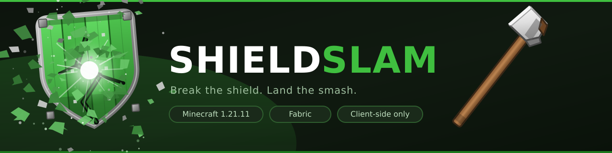

<div align="center">

</div>

Shield Slam is a client-side macro for Minecraft 1.21.11. When someone raises a
shield at you, left-click and it swaps to your axe, knocks the shield down, and
switches back. If you're falling, it goes further and follows the axe hit with a
mace smash.

Left-click is the only trigger. Nothing happens on its own.

## How it works

There are two macros, and you can turn each on separately.

**Stun Slam** is the full combo: axe hit to break the shield, then a mace hit.
It only starts if you've fallen at least 1.5 blocks, because that's what vanilla
requires for the mace's smash bonus.

**Shield Break** is the axe hit on its own. No mace needed, no fall needed — handy
when you're on the ground, which is where most shields go up.

When both are on, the fall distance picks between them:

- falling at least `Min fall` → Stun Slam
- otherwise → Shield Break

So the pair covers the whole exchange: break the shield from the ground, then jump
and slam.

## The panel

Press **Right Shift** in game. Everything is set here.


The status line tells you which macro would fire right now, so if a click does
nothing, that's usually where the answer is. Red means something's missing — no
axe, no mace, or not enough fall.


## Controls

| Key | |
|---|---|
| Left click | Runs the macro |
| Right Shift | Opens the panel |
| V | Toggles the shield break (rebindable in the panel) |

Only Right Shift shows up in Options → Controls. The shield-break key is set in
the panel instead — click **Break key**, then press a key.


## Settings

Saved to `config/stunslam.json`, all editable from the panel.

- **Stun Slam / Shield break** — on or off, independently
- **Delay** — gap between the axe hit and the mace hit
- **Min fall** — fall needed to start the Stun Slam; also decides which macro fires
- **Mace** — restrict it to a DENSITY or BREACH mace
- **Break delay** — gap between the shield-break hit and swapping back
- **Break key** — the key that toggles the shield break

The two delay sliders are in milliseconds and move in 50 ms steps. Minecraft's
game logic runs in whole ticks at 20 per second, so 50 ms is the smallest step
there is. Keep them at 50 or above if you want to actually see the axe swap — at
0 both hits land in the same tick.

## Install

Fabric Loader for 1.21.11 and Fabric API. Drop `shieldslam.jar` in `mods/`.

Client-side only, so it works in singleplayer and on LAN without any setup.

## Building

```
./gradlew build
```

The jar ends up in `build/libs/`.

## License

MIT. See [LICENSE](LICENSE).
