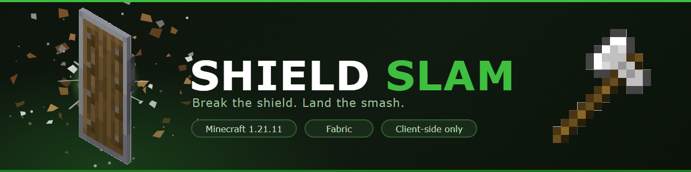
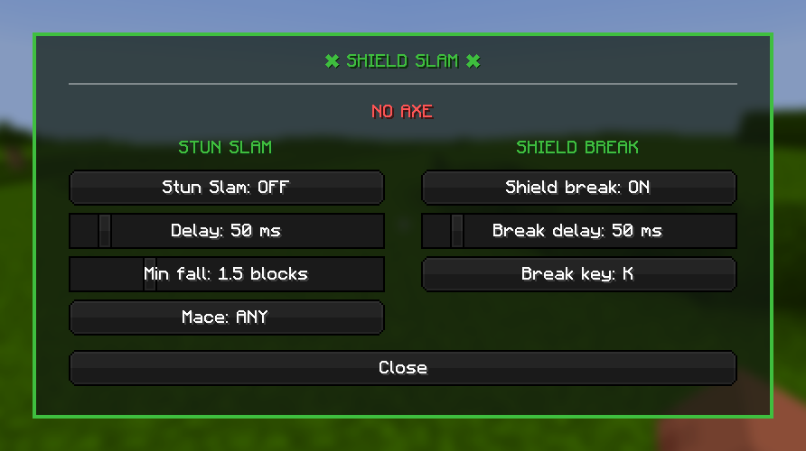
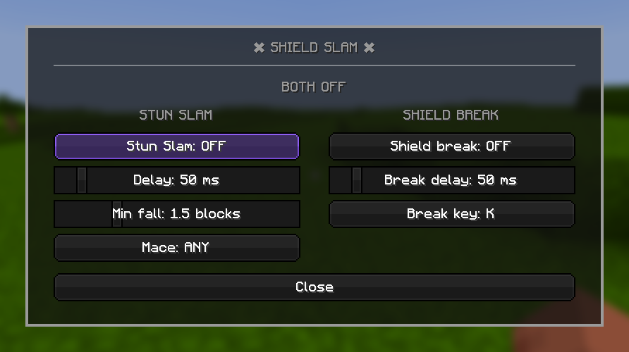
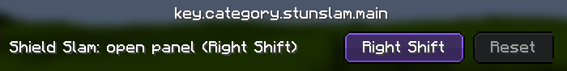

<div align="center">


<br>

[](https://www.minecraft.net/)
[](https://fabricmc.net/)
[](#-install)
[](LICENSE)

**Break the shield. Land the smash.**

A client-side macro for Minecraft 1.21.11. When someone raises a shield at you,
left-click and it swaps to your axe, knocks the shield down, and switches back.
If you're falling, it goes further and follows the axe hit with a mace smash.

</div>

---

## ⚔️ Two macros, one click

| | 🪓 **Stun Slam** | 🛡️ **Shield Break** |
|:---|:---|:---|
| **What it does** | Axe hit to drop the shield, then a mace hit | Axe hit only |
| **Needs a mace** | ✅ Yes | ❌ No |
| **Needs a fall** | ✅ Yes (≥ `Min fall`) | ❌ No |
| **Best for** | Finishing a shielding opponent from the air | Breaking a shield from the ground |

Both have their own switch, and **the fall distance picks between them**:

```
   left-click on a shielding player
   │
   ├─ falling ≥ Min fall   and  Stun Slam is on    ──▶  🪓 Stun Slam
   ├─ otherwise            and  Shield Break is on ──▶  🛡️ Shield Break
   └─ neither                                      ──▶  vanilla handles it
```

So the pair covers the whole exchange: **break the shield on the ground, then jump
and slam.** 🧨

### 🤔 Why the mace needs height

The mace only awards its smash bonus above **1.5 blocks of fall** — that's
vanilla's rule, not a mod limitation. `Min fall` defaults to **1.5** for that
reason. It also doubles as the divider between the two macros, so keep it above 0.

---

## 🎛️ The panel

Press **Right Shift** in game. Everything is set here — no config editing, no
commands.

<div align="center">

</div>

The status line tells you which macro would fire right now, so if a click does
nothing, that's usually where the answer is. 🔴 Red means something is missing —
no axe, no mace, or not enough fall.

<div align="center">

</div>

With both switches off the whole panel goes grey, so you can tell at a glance
that nothing is armed.

---

## 📦 Install

| | |
|:---|:---|
| 1️⃣ | Install [Fabric Loader](https://fabricmc.net/use/installer/) for **1.21.11** |
| 2️⃣ | Drop [Fabric API](https://modrinth.com/mod/fabric-api) into your `mods/` folder |
| 3️⃣ | Drop **`shieldslam.jar`** into `mods/` |
| 4️⃣ | Launch 🚀 |

> 💡 **Client-side only.** Works in singleplayer and on LAN with no setup. On
> dedicated servers, check the server's rules first.

---

## ⌨️ Controls

| Key | |
|:---|:---|
| 🖱️ **Left click** | Runs the macro — the only trigger |
| **Right Shift** | Opens the panel |
| **V** | Toggles the shield break *(rebindable in the panel)* |

Only **Right Shift** appears in `Options → Controls`. The shield-break key is set
**inside the panel** instead — click **Break key**, then press a key. `Esc`
unbinds it.

<div align="center">

</div>

---

## ⚙️ Settings

Saved to `config/stunslam.json`, all editable from the panel.

| Setting | Default | What it does |
|:---|:---:|:---|
| `stunSlamEnabled` | `true` | 🪓 Stun slam on/off |
| `delayMs` | `100` | Gap between the axe hit and the mace hit |
| `minFall` | `1.5` | Fall needed to start the stun slam — also the macro divider |
| `maceType` | `ANY` | Restrict it to a `DENSITY` or `BREACH` mace |
| `shieldBreakEnabled` | `false` | 🛡️ Shield break on/off |
| `shieldBreakKey` | `V` | Key that toggles the shield break |
| `shieldBreakDelayMs` | `100` | Gap between the shield-break hit and swapping back |

### ⏱️ About the millisecond sliders

Minecraft runs its game logic in whole ticks at **20 per second**, so **50 ms is
the smallest step that exists**. The delay sliders move in 50 ms increments for
that reason — anything finer would be a lie about what the engine can do.

| `delayMs` | Combo length |
|:---:|:---|
| `0` | 2 ticks — 100 ms |
| `100` | 4 ticks — 200 ms |
| `500` | 12 ticks — 600 ms |

> ⚠️ **Keep the sliders at 50 or above** if you want to see the axe swap. At `0`
> both hits land in the same tick and the axe is never visible.

---

## 🧩 Requirements

| | |
|:---|:---|
| 🎮 Minecraft | **1.21.11** |
| 🧵 Fabric Loader | 0.19.5+ |
| 📚 Fabric API | required |
| ☕ Java | 21+ |

---

## 🔨 Building

```bash
./gradlew build
```

The jar lands in `build/libs/`.

---

## 📄 License

MIT — see [LICENSE](LICENSE).

<div align="center">
<br>
<sub>Not affiliated with Mojang or Microsoft.</sub>
</div>
